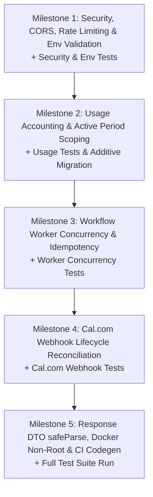

# LeadSprint Phase 2 Implementation Plan

> **Target:** System Reliability, Worker Idempotency, Calendar Lifecycle & Operational Safety  
> **Branch:** `feature/leadsprint-mvp-hardening`  
> **Baseline Commit:** `afdb8b0` ("Phase 1: P0 hardening and booking reliability fixes")  
> **Rule:** Planning only — no application code, migrations, or dependencies modified in this step.

---

## 1. Current Baseline After Phase 1

Phase 1 established foundational scoping, data integrity, and provider security:
* **Demo & Auth Fallback:** `ensureSeedData()` only runs when `LEADSPRINT_DEMO_AUTH=true` AND `NODE_ENV !== "production"`. In production, `scopedBusinessId()` throws a hard error if `req.leadSprintBusinessId` is missing; no silent fallback to `business_demo`.
* **Database Transactions:** Multi-step writes in intake webhook, appointment booking, lead suppression, and user provisioning execute within `db.transaction()`.
* **Per-Business Retell Agent:** Outbound calls via `leadsprint.ts` and `cron.ts` resolve `business.retellAgentId ?? process.env.RETELL_AGENT_ID` and map to Retell's `agent_id` payload field.
* **E.164 Phone Normalization:** `libphonenumber-js` central utility (`src/lib/phone.ts`) validates and formats all inbound and outbound phone numbers across intake, CSV import, manual calls, and queued cron jobs.
* **Auth Provisioning Race Fix:** Re-selects workspace business and user on conflict, eliminating 503 lockouts on concurrent initial logins.
* **Tenant-Scoped Unique Index:** `callsTable` unique index is scoped to `(business_id, provider, provider_call_id)` with an incremental delta migration (`0001_scope_calls_provider_call_unique.sql`).
* **Webhook Freshness Verification:** HMAC signatures are validated first, followed by a 5-minute freshness window across all 4 webhooks (`/intake`, `/retell`, `/twilio/status`, `/calcom`).
* **Cal.com Pre-Checks & UID:** `POST /appointments/book` checks for confirmed appointments before calling Cal.com, uses deterministic operation keys, preserves Cal.com's stable `uid`, and handles DB write failures safely.

---

## 2. P1 Blockers

### 2.1 - Usage Accounting is Period-Unscoped and Hardcoded
* **Severity:** P1
* **Exact file/path:**  
  - [`artifacts/api-server/src/routes/webhooks.ts`](file:///c:/Users/Swetha/Downloads/LeadSprint-Boomi-main/LeadSprint-Boomi-main/artifacts/api-server/src/routes/webhooks.ts#L230-L235)  
  - [`artifacts/api-server/src/routes/leadsprint.ts`](file:///c:/Users/Swetha/Downloads/LeadSprint-Boomi-main/LeadSprint-Boomi-main/artifacts/api-server/src/routes/leadsprint.ts#L655-L660)  
  - [`lib/db/src/schema/leadsprint.ts`](file:///c:/Users/Swetha/Downloads/LeadSprint-Boomi-main/LeadSprint-Boomi-main/lib/db/src/schema/leadsprint.ts#L128-L137)
* **Current behavior:**  
  Retell webhook updates usage with `WHERE business_id = ?` without a period filter, incrementing all rows (including historical periods). `GET /usage` returns the first row found, hardcoding `period_label: "September 2026"` and `included_minutes: 300`. `GET /today` hardcodes `unresolved_messages: 1`.
* **Required behavior:**  
  Usage updates must strictly target the active billing period (`period_start <= NOW() AND period_end >= NOW()`). If no row exists for the current month, auto-provision it. `included_voice_minutes` must be read from the business record. `period_label` must be dynamically formatted from the active period's start date (e.g. "October 2026").
* **Recommended implementation:**  
  1. Add `includedVoiceMinutes: integer("included_voice_minutes").notNull().default(300)` to `businessesTable`.
  2. Implement helper `getActiveUsageRow(businessId, tx)` that selects or inserts the current calendar month row.
  3. Scope usage updates in `webhooks.ts` and `leadsprint.ts` by active usage `id`.
* **Risk:** Low risk; additive schema and query scoping.

---

### 2.2 - Worker Concurrency & Crash Idempotency
* **Severity:** P1
* **Exact file/path:** [`artifacts/api-server/src/routes/cron.ts`](file:///c:/Users/Swetha/Downloads/LeadSprint-Boomi-main/LeadSprint-Boomi-main/artifacts/api-server/src/routes/cron.ts#L82-L155)
* **Current behavior:**  
  `POST /api/cron/process-jobs` selects jobs where `status = 'queued'` and loops sequentially without row locks. Two concurrent workers can select the same jobs and initiate duplicate Retell calls. Furthermore, if a worker crashes after Retell accepts the call but before writing the database update, the job remains stuck or is re-dialed on the next cron cycle.
* **Required behavior:**  
  Atomic job claiming with `FOR UPDATE SKIP LOCKED`, active lease locking (`locked_at`), stale lease recovery, exponential backoff, and strict call-state checking before provider dispatch to prevent double-dialing after crashes.
* **Recommended implementation:**  
  1. Atomic batch claim query transitioning jobs from `queued` to `dispatching` under lease lock.
  2. Stale lease recovery resetting jobs in `dispatching` older than 10 minutes back to `queued`.
  3. Pre-dispatch call check: if the associated `callsTable` row already has a non-null `providerCallId` or status `in_progress`/`completed`/`uncertain`, do NOT dispatch to Retell. Reconcile job to `completed`.
  4. Preserve distinct workflow states: `queued`, `deferred`, `dispatching`, `ringing`, `connected`, `completed`, `failed`, `uncertain`, `blocked`, `cancelled`.
* **Risk:** Medium risk; requires raw SQL for PostgreSQL `FOR UPDATE SKIP LOCKED`.

---

### 2.3 - Wide-Open CORS Policy
* **Severity:** P1
* **Exact file/path:** [`artifacts/api-server/src/app.ts`](file:///c:/Users/Swetha/Downloads/LeadSprint-Boomi-main/LeadSprint-Boomi-main/artifacts/api-server/src/app.ts#L53)
* **Current behavior:**  
  `app.use(cors())` allows requests from any origin (`*`). The SPA is served same-origin in production, making unrestricted CORS unnecessary and unsafe.
* **Required behavior:**  
  CORS must be restricted. When running in production, requests from unapproved origins must be rejected.
* **Recommended implementation:**  
  Configure `cors` middleware with `CORS_ALLOWED_ORIGINS` whitelist. In local dev, allow localhost; in production, allow same-origin and explicitly configured domains.
* **Risk:** Low risk.

---

### 2.4 - Lack of Rate Limiting on Webhooks and Cron Endpoints
* **Severity:** P1
* **Exact file/path:**  
  - [`artifacts/api-server/src/app.ts`](file:///c:/Users/Swetha/Downloads/LeadSprint-Boomi-main/LeadSprint-Boomi-main/artifacts/api-server/src/app.ts)  
  - [`artifacts/api-server/src/routes/webhooks.ts`](file:///c:/Users/Swetha/Downloads/LeadSprint-Boomi-main/LeadSprint-Boomi-main/artifacts/api-server/src/routes/webhooks.ts)  
  - [`artifacts/api-server/src/routes/cron.ts`](file:///c:/Users/Swetha/Downloads/LeadSprint-Boomi-main/LeadSprint-Boomi-main/artifacts/api-server/src/routes/cron.ts)
* **Current behavior:**  
  Endpoints have no rate limiting. A flood of unauthenticated or malicious requests can exhaust database connections.
* **Required behavior:**  
  Apply rate limiting to `/api/webhooks/*` (e.g. 120 req/min per IP) and `/api/cron/*` (e.g. 20 req/min per IP) without dropping legitimate provider bursts.
* **Recommended implementation:**  
  Install `express-rate-limit` in `@workspace/api-server` and mount separate rate limiters for webhooks and cron endpoints.
* **Risk:** Low risk.

---

### 2.5 - Schema.parse() Crashes Endpoint with HTTP 500 on Minor Response Shape Drift
* **Severity:** P1
* **Exact file/path:** [`artifacts/api-server/src/routes/leadsprint.ts`](file:///c:/Users/Swetha/Downloads/LeadSprint-Boomi-main/LeadSprint-Boomi-main/artifacts/api-server/src/routes/leadsprint.ts)
* **Current behavior:**  
  Endpoints execute `Schema.parse(dto)`. If an optional field is `null` or a database enum has a new value not yet in the client Zod schema, `.parse()` throws a `ZodError` resulting in a hard HTTP 500 error.
* **Required behavior:**  
  Use `safeParse()`. If validation fails, log a structured warning containing the validation issues, but serve the payload rather than crashing the endpoint.
* **Recommended implementation:**  
  Helper `sendValidatedResponse(res, schema, data, status = 200)`.
* **Risk:** Low risk; strictly increases resilience.

---

### 2.6 - Cal.com Webhooks Do Not Reconcile Bookings, Reschedules, or Cancellations
* **Severity:** P1
* **Exact file/path:** [`artifacts/api-server/src/routes/webhooks.ts`](file:///c:/Users/Swetha/Downloads/LeadSprint-Boomi-main/LeadSprint-Boomi-main/artifacts/api-server/src/routes/webhooks.ts#L300-L325)
* **Current behavior:**  
  `POST /api/webhooks/calcom` records the event in `provider_events` and immediately returns 202. It never updates `appointmentsTable` or `leadsTable`. Cancellations and reschedules on Cal.com have zero effect on workspace state.
* **Required behavior:**  
  Parse `body.triggerEvent` using verified Cal.com webhook fields and reconcile state within a database transaction:
  - `BOOKING_CONFIRMED`: Update appointment status to `"confirmed"`.
  - `BOOKING_RESCHEDULED`: Update `startTime` and `endTime` from `payload.startTime` and `payload.endTime`; update lead's `nextAction`.
  - `BOOKING_CANCELLED`: Update appointment status to `"cancelled"`; update lead's `nextAction: "Reschedule showing"`; log an activity.
* **Recommended implementation:**  
  Extract `uid = payload.uid`. Query appointment by `(businessId, externalId: uid)`. Update appointment and lead records inside `db.transaction()`.
* **Risk:** Low risk; uses existing verified fields.

---

### 2.7 - Production Docker Migration Execution & Non-Root Runtime
* **Severity:** P1
* **Exact file/path:** [`Dockerfile`](file:///c:/Users/Swetha/Downloads/LeadSprint-Boomi-main/LeadSprint-Boomi-main/Dockerfile)
* **Current behavior:**  
  The Dockerfile runtime stage runs as `root`. Furthermore, `drizzle-kit` is in `devDependencies` of `@workspace/db` and is pruned by `pnpm install --prod`. Attempting to run `drizzle-kit migrate` in the production container would fail due to missing CLI binaries.
* **Required behavior:**  
  1. Container must run as non-root user `USER node`.
  2. The production container must execute pending versioned migrations at startup using a mechanism available in production (e.g. programmatic `drizzle-orm` migrator which is in production `dependencies`, or retaining the migration tool in the production image).
* **Recommended implementation:**  
  Use `drizzle-orm`'s built-in programmatic migrator (`drizzle-orm/node-postgres/migrator` or `drizzle-orm/pg/migrator`) executed via a lightweight startup runner script `scripts/migrate.mjs` before launching Express.
* **Risk:** Low risk; avoids reliance on devDependencies in production.

---

### 2.8 - CI Pipeline Does Not Detect API Client Contract Drift
* **Severity:** P1
* **Exact file/path:** [`.github/workflows/ci.yml`](file:///c:/Users/Swetha/Downloads/LeadSprint-Boomi-main/LeadSprint-Boomi-main/.github/workflows/ci.yml)
* **Current behavior:**  
  CI runs `typecheck` and `build`, but does not run Orval code generation. If an API contract in `api-spec` is modified without committing the generated client artifacts, CI does not detect the drift.
* **Required behavior:**  
  CI must run codegen and verify that `git diff --exit-code lib/api-client-react lib/api-zod` is clean.
* **Recommended implementation:**  
  Add step in `.github/workflows/ci.yml`:
  ```yaml
  - name: Check API spec codegen drift
    run: |
      pnpm --filter @workspace/api-spec run codegen
      git diff --exit-code lib/api-client-react lib/api-zod
  ```
* **Risk:** Zero risk.

---

### 2.9 - Startup Environment Variable Validation
* **Severity:** P1
* **Exact file/path:** [`artifacts/api-server/src/index.ts`](file:///c:/Users/Swetha/Downloads/LeadSprint-Boomi-main/LeadSprint-Boomi-main/artifacts/api-server/src/index.ts)
* **Current behavior:**  
  Only `PORT` is validated at boot. If `DATABASE_URL` is invalid or `CRON_SECRET` is missing in production, errors only surface at runtime when requests arrive.
* **Required behavior:**  
  Validate environment variables at startup using Zod. Mandatory in production: `DATABASE_URL`, `CRON_SECRET`, and Clerk secrets (when demo auth is off). Optional/disabled providers (Retell, Cal.com, Twilio) must NOT be mandatory if those providers are not configured or when running in local demo mode.
* **Recommended implementation:**  
  Create `artifacts/api-server/src/lib/env.ts` with conditional validation rules and call it in `index.ts`.
* **Risk:** Low risk.

---

## 3. Database Changes

### Required Schema Adjustments
1. **`businessesTable`**:
   - Add `includedVoiceMinutes: integer("included_voice_minutes").notNull().default(300)`
2. **`workflowJobsTable`**:
   - Add index on `(type, status, available_at)` for fast batch polling.
   - Add index on `(status, locked_at)` for fast stale lease recovery.

### Incremental Migration Strategy
- Migration file: `lib/db/drizzle/0002_phase2_reliability_indexes.sql`
- Contains strictly additive SQL:
  ```sql
  ALTER TABLE "businesses" ADD COLUMN IF NOT EXISTS "included_voice_minutes" integer DEFAULT 300 NOT NULL;--> statement-breakpoint
  CREATE INDEX IF NOT EXISTS "workflow_jobs_poll_idx" ON "workflow_jobs" ("type", "status", "available_at");--> statement-breakpoint
  CREATE INDEX IF NOT EXISTS "workflow_jobs_lease_idx" ON "workflow_jobs" ("status", "locked_at");
  ```
- Register entry `idx: 2` in `lib/db/drizzle/meta/_journal.json`.
- Do NOT use `drizzle-kit push`.

---

## 4. Usage & Billing

### Active Period Scoping & Idempotency
1. **Active Period Lookup:**  
   When incrementing minutes or booking counts, resolve active usage by:
   ```sql
   SELECT id FROM usage
   WHERE business_id = ? AND period_start <= NOW() AND period_end >= NOW()
   LIMIT 1;
   ```
   If no row exists (e.g. new billing month), insert the current calendar month row with boundaries:
   - `period_start`: First day of current month at 00:00:00 UTC.
   - `period_end`: Last day of current month at 23:59:59 UTC.
2. **Usage Event Idempotency:**  
   In `webhooks.ts`, `acceptProviderEvent` executes **BEFORE** usage mutations. If the same Retell webhook event is redelivered, `acceptProviderEvent` returns `false` due to the `(provider, external_event_id)` unique index, preventing double-billing on retries.
3. **Dynamic Response:**  
   In `GET /usage`:
   - `period_label`: Formatted dynamically as `Intl.DateTimeFormat("en-US", { month: "long", year: "numeric" }).format(usage.periodStart)`.
   - `included_minutes`: Read from `business.includedVoiceMinutes`.
4. **Unresolved Messages Analysis:**  
   `activitiesTable` currently has no `resolved` or `status` column.  
   *Action:* To provide a semantically correct count without inventing schema fields, query `leadsTable` for active leads where `next_action ILIKE '%Call back%'` (representing unhandled human callback requests). If a dedicated activity resolution state is required in the future, mark it for Phase 3 schema expansion.

---

## 5. Workflow Worker Reliability

### Workflow & Call State Architecture

The system preserves distinct operational states across `workflow_jobs` and `callsTable`:

| State | Workflow Job Meaning | Call Record Meaning |
| :--- | :--- | :--- |
| **`queued`** | Ready to be claimed by scheduler | Call record created; awaiting dispatch |
| **`deferred`** | Held for quiet hours or retry backoff (`available_at > NOW()`) | Awaiting dispatch window |
| **`dispatching`** | Claimed by worker under active lease (`locked_at = NOW()`) | Outbound request being prepared/sent |
| **`ringing`** | Call accepted by provider; dialing recipient | Provider reported ringing state |
| **`connected`** | Call in progress with recipient | Active voice interaction |
| **`completed`** | Job successfully finalized | Call ended normally and analyzed |
| **`failed`** | Max attempts reached or terminal error | Permanent failure reported |
| **`uncertain`** | Provider request timed out or unconfirmed | State unconfirmed; awaiting reconciliation |
| **`blocked`** | Policy violation (consent, DNC, max attempts) | Blocked by policy gate |
| **`cancelled`** | Superseded or operator-cancelled | Cancelled before connection |

### Worker Concurrency & Idempotency Plan
1. **Atomic Batch Claiming:**
   Claim up to 25 queued jobs using raw SQL:
   ```sql
   UPDATE workflow_jobs
   SET status = 'dispatching', locked_at = NOW()
   WHERE id IN (
     SELECT id FROM workflow_jobs
     WHERE type = 'initiate_call' AND status = 'queued' AND available_at <= NOW()
     ORDER BY available_at ASC
     LIMIT 25
     FOR UPDATE SKIP LOCKED
   )
   RETURNING *;
   ```
2. **Stale Lease Recovery:**
   Before claiming new jobs, recover jobs stuck in `dispatching` (>10 minutes):
   ```sql
   UPDATE workflow_jobs
   SET status = 'queued', locked_at = NULL, attempts = attempts + 1
   WHERE status = 'dispatching' AND locked_at < NOW() - INTERVAL '10 minutes';
   ```
3. **Double-Dial Prevention After Crash:**
   Before calling `startRetellCall()`, inspect the associated `call`:
   - If `call.providerCallId` is already populated: The provider already accepted the call! Do NOT call Retell again. Update the job to `completed`.
   - If `call.status` is `in_progress`, `completed`, or `uncertain`: Do NOT call Retell again.
4. **Quiet Hours Deferral:**
   If blocked by quiet hours, update job to `status = 'deferred'`, setting `available_at = NOW() + 30 minutes` without marking the job as permanently failed.
5. **Exponential Retry Backoff:**
   On temporary provider or network failures:
   `available_at = NOW() + (2 ^ attempts) minutes` (up to 5 attempts).

---

## 6. Cal.com Integration

### Verified Contract Fields
Based on inspection of `providers.ts` and `webhooks.ts`, Cal.com uses:
- **Booking UID:** `body.payload.uid` (primary UUID string) with fallback to `body.payload.bookingId` or `body.payload.id`.
- **Event Type:** `body.triggerEvent` (e.g. `"BOOKING_CREATED"`, `"BOOKING_RESCHEDULED"`, `"BOOKING_CANCELLED"`).
- **Slot Boundaries:** `body.payload.startTime` and `body.payload.endTime` (ISO strings).
- **Tenant Context:** `body.metadata.business_id` or `body.payload.metadata.business_id`.
- **Reason Fields:** `body.payload.cancellationReason` or `body.payload.rescheduleReason`.

### Webhook Reconciliation Implementation
Inside `POST /api/webhooks/calcom`:
```ts
const trigger = body.triggerEvent;
const uid = String(payload.uid ?? payload.bookingId ?? payload.id ?? "");
if (!uid) return;

await db.transaction(async (tx) => {
  const [appointment] = await tx
    .select()
    .from(appointmentsTable)
    .where(and(eq(appointmentsTable.businessId, businessId), eq(appointmentsTable.externalId, uid)))
    .limit(1);

  if (!appointment) return;

  if (trigger === "BOOKING_CANCELLED") {
    await tx.update(appointmentsTable).set({ status: "cancelled" }).where(eq(appointmentsTable.id, appointment.id));
    await tx.update(leadsTable).set({ nextAction: "Follow up — appointment cancelled", updatedAt: new Date() }).where(eq(leadsTable.id, appointment.leadId));
    await tx.insert(activitiesTable).values({ id: id("activity"), businessId, type: "booking", title: "Appointment cancelled", detail: `Cal.com booking ${uid} was cancelled.` });
  } else if (trigger === "BOOKING_RESCHEDULED") {
    const newStart = payload.startTime ? new Date(payload.startTime as string) : appointment.startTime;
    const newEnd = payload.endTime ? new Date(payload.endTime as string) : appointment.endTime;
    await tx.update(appointmentsTable).set({ startTime: newStart, endTime: newEnd, status: "confirmed" }).where(eq(appointmentsTable.id, appointment.id));
    await tx.update(leadsTable).set({ nextAction: "Appointment rescheduled", updatedAt: new Date() }).where(eq(leadsTable.id, appointment.leadId));
    await tx.insert(activitiesTable).values({ id: id("activity"), businessId, type: "booking", title: "Appointment rescheduled", detail: `Showing rescheduled for ${newStart.toISOString()}.` });
  } else if (trigger === "BOOKING_CREATED" || trigger === "BOOKING_CONFIRMED") {
    await tx.update(appointmentsTable).set({ status: "confirmed" }).where(eq(appointmentsTable.id, appointment.id));
  }
});
```

---

## 7. Security

1. **CORS:** Configured origin whitelist via `CORS_ALLOWED_ORIGINS`. Reject untrusted origins in production with credentials support.
2. **Rate Limiting:**
   - Mount `rateLimit` on `/api/webhooks/*`: 120 requests/min per IP.
   - Mount `rateLimit` on `/api/cron/*`: 20 requests/min per IP.
3. **Cron Authentication:** Enforce `CRON_SECRET` in production. If missing in production, fail closed with HTTP 500.
4. **Logging / PII:** Ensure request logger serializer redacts authorization headers, webhook signature headers, and full phone numbers.

---

## 8. Docker & Deployment

1. **User Non-Root:** Add `USER node` before `EXPOSE` and `CMD` in `Dockerfile`.
2. **Production Migration Runner:**
   - Do NOT run `drizzle-kit` CLI in production because `drizzle-kit` is a `devDependency` pruned by `pnpm install --prod`.
   - Instead, create a programmatic runner `lib/db/src/migrate.ts` using `drizzle-orm`'s runtime migrator:
     ```ts
     import { migrate } from "drizzle-orm/node-postgres/migrator";
     import { db } from "./index";
     await migrate(db, { migrationsFolder: "./lib/db/drizzle" });
     ```
   - In `Dockerfile` CMD, run the compiled migrator before starting the Express server:
     `CMD ["sh", "-c", "node lib/db/dist/migrate.mjs && node --enable-source-maps artifacts/api-server/dist/index.mjs"]`

---

## 9. CI/CD

1. **API Spec Codegen Drift Check:**  
   Add a verification step in `.github/workflows/ci.yml`:
   ```yaml
   - name: Verify API Client Codegen Drift
     run: |
       pnpm --filter @workspace/api-spec run codegen
       git diff --exit-code lib/api-client-react lib/api-zod
   ```
2. **Automated Unit Testing Step:**  
   Add `pnpm test` step to CI workflow to ensure tests run on all PRs.

---

## 10. Automated Testing

### Framework: Vitest
Add `vitest` to `@workspace/api-server` (lightweight, native ESM, matches Vite).

### Target Test Suites:
1. `artifacts/api-server/src/lib/policy.test.ts`: Quiet hours, suppression, max attempts, kill switch.
2. `artifacts/api-server/src/lib/phone.test.ts`: E.164 normalization, international prefixes, invalid inputs.
3. `artifacts/api-server/src/routes/webhooks.test.ts`: HMAC signature verification, timestamp freshness window, deduplication.
4. `artifacts/api-server/src/routes/cron.test.ts`: Atomic claiming, backoff calculation, stale lease recovery.
5. `artifacts/api-server/src/routes/usage.test.ts`: Period scoping, active period auto-provisioning.

---

## 11. Environment Configuration

### Validation Schema (`artifacts/api-server/src/lib/env.ts`)
```ts
import { z } from "zod";

export const EnvSchema = z.object({
  NODE_ENV: z.enum(["development", "test", "production"]).default("development"),
  PORT: z.coerce.number().default(5000),
  DATABASE_URL: z.string().url(),
  LEADSPRINT_DEMO_AUTH: z.enum(["true", "false"]).optional(),
  CRON_SECRET: z.string().min(16).optional(),
  CLERK_SECRET_KEY: z.string().optional(),
  CLERK_PUBLISHABLE_KEY: z.string().optional(),
  RETELL_API_KEY: z.string().optional(),
  RETELL_WEBHOOK_SECRET: z.string().optional(),
  CALCOM_API_KEY: z.string().optional(),
  CALCOM_WEBHOOK_SECRET: z.string().optional(),
}).refine((data) => {
  if (data.NODE_ENV === "production") {
    if (!data.CRON_SECRET) return false;
    if (data.LEADSPRINT_DEMO_AUTH !== "true" && !data.CLERK_SECRET_KEY) return false;
  }
  return true;
}, { message: "Production deployment requires DATABASE_URL, CRON_SECRET, and CLERK_SECRET_KEY (when demo auth is off)" });
```
*Notice:* Retell and Cal.com credentials remain optional if those services are not enabled, ensuring local and demo modes remain functional.

---

## 12. Implementation Order

To maintain stability and enable early validation, implementation and testing are coupled in 5 distinct milestones:



1. **Milestone 1: Security Foundation & Environment Validation**
   - Implement `env.ts` startup validation.
   - Configure CORS origin whitelist and rate limiters on `/api/webhooks/*` and `/api/cron/*`.
   - Add unit tests for environment validation and rate limiting.

2. **Milestone 2: Usage Accounting Scoping & Additive Migration**
   - Add `includedVoiceMinutes` to `businessesTable` via incremental migration `0002_...`.
   - Scope usage queries to active billing period in `webhooks.ts` and `leadsprint.ts`.
   - Add unit tests for period calculation and usage increment idempotency.

3. **Milestone 3: Workflow Worker Concurrency & Crash Idempotency**
   - Implement atomic job claiming (`FOR UPDATE SKIP LOCKED`) and lease recovery.
   - Add pre-dispatch call checks and exponential backoff retry.
   - Add concurrency and crash recovery unit tests.

4. **Milestone 4: Cal.com Webhook Reconciliation**
   - Implement `BOOKING_CONFIRMED`, `BOOKING_RESCHEDULED`, and `BOOKING_CANCELLED` handlers in `POST /api/webhooks/calcom`.
   - Add webhook event simulation unit tests.

5. **Milestone 5: Response DTO Resiliency, Docker Security & CI Drift**
   - Replace `.parse()` with `safeParse()` in Express response handlers.
   - Add `USER node` to `Dockerfile` and setup programmatic migration execution.
   - Add codegen drift check in `.github/workflows/ci.yml`.
   - Execute full test suite (`pnpm test`) across workspace.

---

## 13. Verification Plan

### Incremental Verification Checklist
* **Milestone 1 Verification:**
  - Verify startup throws when `CRON_SECRET` is missing with `NODE_ENV=production`.
  - Verify rate limiter blocks after exceeding burst thresholds on `/api/cron` and `/api/webhooks`.
  - Run `pnpm test` (security & env suites).
* **Milestone 2 Verification:**
  - Verify `GET /api/usage` returns dynamic month label.
  - Verify Retell webhook only increments current month's usage row.
  - Run `pnpm test` (usage accounting suite).
* **Milestone 3 Verification:**
  - Run parallel worker invocation tests to verify zero duplicate calls are dispatched.
  - Verify expired lease jobs are recovered back to `queued`.
  - Run `pnpm test` (worker concurrency suite).
* **Milestone 4 Verification:**
  - Post mock signed Cal.com reschedule and cancel events; verify appointment status updates in DB.
  - Run `pnpm test` (Cal.com lifecycle suite).
* **Milestone 5 Verification:**
  - Intentionally pass extra field in response DTO; verify endpoint returns 200 with logged warning instead of 500.
  - Run Docker container build and verify non-root user execution (`id -u` is 1000).
  - Run full CI checks (`pnpm run typecheck`, `pnpm test`, build).

---

## 14. Risks / Remaining Limitations

1. **PostgreSQL Concurrency at High Volume:**  
   `FOR UPDATE SKIP LOCKED` is optimal and reliable for MVP volumes (<10,000 jobs/day) without introducing Redis or external queue infrastructure. If call volumes scale to hundreds of concurrent jobs per second, dedicated queue infrastructure (e.g. BullMQ/Redis) would be evaluated in a later phase.
2. **Unresolved Messages Semantics:**  
   Without an explicit `resolved_at` column in `activitiesTable`, `unresolved_messages` will be derived from active leads requiring human callbacks (`next_action ILIKE '%Call back%'`). A dedicated messaging inbox model should be considered for Phase 3.

---

## Final Verdict

**PHASE 2 READY FOR IMPLEMENTATION**
