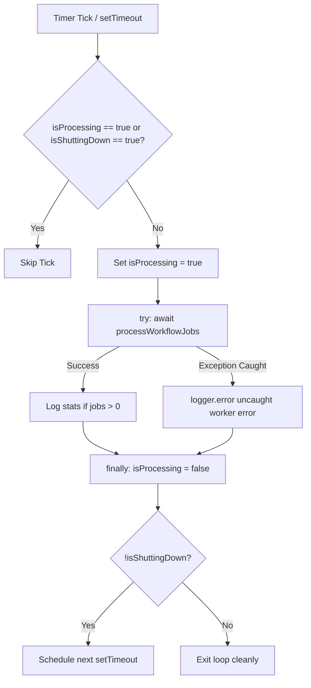

# Phase 3 Milestone 6 Implementation Plan: Operational Safety & Deployment Reliability

> **Milestone:** Phase 3 Milestone 6  
> **Status:** PENDING REVIEW (Plan Only — No changes made)  
> **Base Commit:** `0f520d9f953caf785f26e39d9eb531ca6092e2c0` (*feat(intake): support lead re-engagement and tenant-safe deduplication*)  
> **Branch:** `feature/leadsprint-mvp-hardening`  
> **Post-M5 Audit Baseline:** `docs/POST_M5_PRODUCTION_SELLABILITY_AUDIT.md` (Readiness: 9.7/10, Verdict: GO)  
> **Target Scope:** 
> 1. In-UI Emergency Calling Pause (M6-A)  
> 2. Optional Internal Worker Scheduler (M6-B)  
> 3. Same-Contact Active-Call Protection (M6-C)  

---

## 1. Executive Summary

Following the successful completion of Phase 3 Milestones 1 through 5, the Post-M5 Production & Sellability Audit confirmed an overall readiness score of **9.7/10** with **zero P0 blockers**.

**Phase 3 Milestone 6** addresses the remaining operational safety and deployment reliability items identified in the audit. It introduces three strictly scoped improvements:
1. **In-UI Emergency Calling Pause (M6-A):** Adds a tenant-scoped `calling_paused` boolean state to `businessesTable`, exposed through the authenticated OpenAPI specification, Business Settings API, and Owner Console UI with "Pause Dialing" / "Resume Dialing" controls.
2. **Optional Internal Worker Scheduler (M6-B):** Adds an opt-in, non-overlapping in-process background worker loop in `artifacts/api-server/src/index.ts` (gated by `ENABLE_INTERNAL_WORKER=true`), enabling self-contained single-container deployments without requiring an external HTTP cron runner.
3. **Same-Contact Active-Call Protection (M6-C):** The LeadSprint worker dispatch path serializes same-contact call authorization across concurrent workers and prevents duplicate outbound dispatch caused by concurrent worker races.

---

## 2. Current-State Findings

Based on inspection of commit `0f520d9`:

| Component | Current Implementation | Limitation / Operational Risk |
| :--- | :--- | :--- |
| **Kill Switch / Calling Pause** | `isKillSwitchEngaged()` in [`lib/policy.ts`](file:///c:/Users/Swetha/Downloads/LeadSprint-Boomi-main/LeadSprint-Boomi-main/artifacts/api-server/src/lib/policy.ts) reads `process.env["LEADSPRINT_KILL_SWITCH"]`. | Global process-level env var only. Operators cannot pause calling for a specific business directly from the Owner Console UI. |
| **Worker Execution** | [`routes/cron.ts`](file:///c:/Users/Swetha/Downloads/LeadSprint-Boomi-main/LeadSprint-Boomi-main/artifacts/api-server/src/routes/cron.ts) exposes `POST /api/cron/process-jobs` requiring `x-cron-secret`. | Standalone container deployments (e.g. single Docker/Coolify instance without a configured cron runner) do not automatically drain queued jobs unless externally pinged. |
| **Worker Concurrency** | [`lib/worker.ts`](file:///c:/Users/Swetha/Downloads/LeadSprint-Boomi-main/LeadSprint-Boomi-main/artifacts/api-server/src/lib/worker.ts) locks individual `workflow_jobs` via `FOR UPDATE SKIP LOCKED` and checks `callsTable.status` in-memory per job. | If multiple jobs exist for the *same contact* (e.g. multi-property submission or rapid manual clicks), multiple concurrent worker instances could claim separate jobs for the same contact simultaneously. |
| **API Contract Codegen** | API contracts are generated from [`lib/api-spec/openapi.yaml`](file:///c:/Users/Swetha/Downloads/LeadSprint-Boomi-main/LeadSprint-Boomi-main/lib/api-spec/openapi.yaml) via Orval (`pnpm --filter @workspace/api-spec run codegen`). | `calling_paused` must be added to `openapi.yaml` first, then compiled to TypeScript and Zod schemas to maintain codegen integrity. |

---

## 3. M6 Goals

- **Goal 1:** Provide tenant-scoped calling pause controls in the Operator Console without modifying existing workflow job data or deleting records.
- **Goal 2:** Support self-contained single-process deployments with a reliable, non-overlapping internal worker timer loop that coexists safely with external cron and multi-replica environments.
- **Goal 3:** The LeadSprint worker dispatch path serializes same-contact call authorization across concurrent workers and prevents duplicate outbound dispatch caused by concurrent worker races.
- **Goal 4:** Maintain 100% backward compatibility and ensure all 176 existing automated tests continue to pass.

---

## 4. M6-A: In-UI Emergency Calling Pause

### 4.1. Core Requirements & Pause Semantics

The pause feature strictly distinguishes the following lifecycle states:

1. **Existing in-flight Retell call:**
   - **NOT** cancelled or terminated when pause is enabled. An already connected or ringing phone call proceeds to natural completion.
2. **Claimed-but-not-dispatched workflow job:**
   - Pre-dispatch policy check `evaluateCallPolicy()` runs immediately prior to provider dispatch and blocks the call from starting.
3. **Queued / deferred workflow jobs:**
   - Preserved in `workflow_jobsTable`. When evaluated by the worker while paused, jobs are deferred (`status: "deferred"`, `availableAt = now + 5 minutes`, `lockedAt = null`, `lockedBy = null`, `leaseExpiresAt = null`). Jobs are **NOT** deleted, and call history is preserved.
4. **Manual Dialing (`POST /api/calls/start`):**
   - Blocked with HTTP 409 `policy_blocked` while tenant `callingPaused` is `true`.
5. **Global Environment Kill Switch (`LEADSPRINT_KILL_SWITCH`):**
   - Continues to act as a global master override: if either `business.callingPaused === true` OR `LEADSPRINT_KILL_SWITCH === true`, calling is blocked.

### 4.2. Policy Engine Implementation (`artifacts/api-server/src/lib/policy.ts`)
```ts
export interface PolicyBusinessInput {
  timezone: string;
  quietHours: string | null | undefined;
  maxCallAttempts: number;
  includedVoiceMinutes?: number;
  currentVoiceMinutes?: number;
  callingPaused?: boolean | null;
}

// Inside evaluateCallPolicy():
const isPaused = business.callingPaused === true || isKillSwitchEngaged();
if (isPaused) {
  return {
    allowed: false,
    reason: "kill_switch",
    message: business.callingPaused
      ? "Outbound calling is paused for this workspace."
      : "LEADSPRINT_KILL_SWITCH is engaged; all outbound calling is paused.",
  };
}
```

### 4.3. API Contract & OpenAPI Specification
- **Source of Truth (`lib/api-spec/openapi.yaml`):**
  - Add `calling_paused` (boolean, optional on update, required on read) to `BusinessSettings`, `UpdateBusinessSettingsBody`, `AuthMeResponse`.
- **Codegen Command:**
  - `pnpm --filter @workspace/api-spec run codegen`
  - Generates `@workspace/api-zod` schemas and `@workspace/api-client-react` hooks.
- **API Server Route (`artifacts/api-server/src/routes/leadsprint.ts`):**
  - `GET /api/business-settings`: includes `calling_paused: Boolean(business.callingPaused)`.
  - `PATCH /api/business-settings`: updates `businessesTable.callingPaused` when `body.data.calling_paused` is provided.
  - `GET /api/auth/me`: includes `calling_paused: Boolean(business.callingPaused)`.

### 4.4. Operator Console UI (`artifacts/leadsprint/src/App.tsx`)
- **Settings Desk (`/workspace/business-settings`):**
  - Adds a dedicated **Calling Status / Emergency Pause** section.
  - Explains the pause semantics accurately:
    > *"Pausing stops NEW outbound calling. It does not terminate an already active/in-flight call."*
  - Renders action button:
    - When active: Button variant `danger` with label **"Pause Dialing"**.
    - When paused: Button variant `primary` with label **"Resume Dialing"**.
- **Today Desk Header Banner (`/workspace`):**
  - When `calling_paused === true`, renders an informative amber alert: *"Outbound calling is paused for this workspace. Pausing stops new outbound calling. Inbound leads are queued safely without automatic dialing."* with a direct **"Resume"** button.

---

## 5. M6-B: Optional Internal Worker Scheduler

### 5.1. Configuration & Conventions
In accordance with the repository's environment validation patterns in [`artifacts/api-server/src/lib/env.ts`](file:///c:/Users/Swetha/Downloads/LeadSprint-Boomi-main/LeadSprint-Boomi-main/artifacts/api-server/src/lib/env.ts):
- `ENABLE_INTERNAL_WORKER`: `z.string().optional()` (evaluated via `value?.trim().toLowerCase() === "true"`).
- `INTERNAL_WORKER_INTERVAL_MS`: `z.coerce.number().int().positive().optional()` (default: `30000` = 30 seconds; minimum: `5000`ms, maximum: `300000`ms).

### 5.2. Architecture & Concurrency Model


- **Overlap Prevention:** Uses recursive `setTimeout` rather than `setInterval`. The next timer is scheduled only *after* the previous `processWorkflowJobs()` execution has fully resolved, ensuring no concurrent overlapping ticks on the same process.
- **Resource Impact:** The scheduler runs at the configured interval and performs normal worker database polling. Resource impact should be validated under the expected deployment workload.
- **Error Boundary:** The tick is wrapped in a `try...catch`. Any unexpected database or network exception is caught and logged; it does not throw into the Node.js root event loop or crash the API process.
- **Graceful Shutdown Lifecycle:**
  On `SIGTERM` / `SIGINT`:
  1. Stop scheduling new worker ticks.
  2. Set scheduler state to shutting down (`isShuttingDown = true`).
  3. Allow the currently executing `processWorkflowJobs()` invocation to finish for a bounded timeout (default: `10000`ms = 10s).
  4. If the timeout expires:
     - Stop waiting.
     - Do **NOT** manually mark external Retell calls as failed solely because the process is shutting down.
     - Rely on existing database leases (`leaseExpiresAt`) and stale-lease recovery (`recoverStaleLeases`) for unfinished workflow work on the next boot.
  5. Close HTTP server and database pool cleanly.
- **Multi-Replica & External Cron Safety:**
  - `processWorkflowJobs()` relies on PostgreSQL `FOR UPDATE SKIP LOCKED`.
  - Multiple container instances with `ENABLE_INTERNAL_WORKER=true` and external calls to `POST /api/cron/process-jobs` can run simultaneously without job conflict: each worker atomically claims distinct rows from the shared queue.

---

## 6. M6-C: Same-Contact Active-Call Protection

### 6.1. Application-Level Concurrency Guarantee & Limitation

> **Application-Level Guarantee:** The LeadSprint worker dispatch path serializes same-contact call authorization across concurrent workers and prevents duplicate outbound dispatch caused by concurrent worker races.
>
> **Explicit Limitation:** PostgreSQL row locking cannot transactionally lock the external Retell API request itself. The protection guarantees serialized application-level authorization immediately before provider dispatch; it does not claim an atomic database lock over the external network request.

### 6.2. Concurrency Sequence Across Workers

| Step | Worker A (First to Claim Contact) | Worker B (Concurrent Competing Worker) |
| :---: | :--- | :--- |
| **1** | Locks contact row (`SELECT ... FROM contacts WHERE id = $1 FOR UPDATE`). | Attempts to lock same contact row; waits on database lock. |
| **2** | Checks `callsTable` for active calls; sees 0 active calls. | Blocked waiting. |
| **3** | Marks its call `status = "provider_requesting"`, `startedAt = now`. | Blocked waiting. |
| **4** | Commits transaction and releases contact row lock. | Acquires contact row lock. |
| **5** | Calls external Retell API (`startRetellCall`). | Checks `callsTable` for active calls; sees Worker A's `provider_requesting` call. |
| **6** | — | Defers its job for 2 minutes (`status: "deferred"`); **does NOT call Retell**. |

### 6.3. Two-Tier Serialization & Active Call Detection

#### Tier 1: Transactional Contact Authorization
Before calling `startRetellCall()`, the worker initiates a database transaction:
```ts
let shouldDispatch = false;

await db.transaction(async (tx) => {
  // 1. Lock the contact row across all competing workers
  const [lockedContact] = await tx
    .select({ id: contactsTable.id })
    .from(contactsTable)
    .where(
      and(
        eq(contactsTable.id, call.contactId),
        eq(contactsTable.businessId, job.businessId),
      ),
    )
    .for("update");

  if (!lockedContact) {
    return;
  }

  // 2. Query callsTable for any active call for this contact
  // A call is considered active if status is in_progress, provider_accepted,
  // or a fresh provider_requesting (created within the last 5 minutes)
  const staleThreshold = new Date(now.getTime() - 5 * 60 * 1000);
  const activeCalls = await tx
    .select({ id: callsTable.id, status: callsTable.status })
    .from(callsTable)
    .where(
      and(
        eq(callsTable.businessId, job.businessId),
        eq(callsTable.contactId, call.contactId),
        ne(callsTable.id, call.id),
        or(
          inArray(callsTable.status, ["in_progress", "provider_accepted"]),
          and(
            eq(callsTable.status, "provider_requesting"),
            gte(callsTable.createdAt, staleThreshold),
          ),
        ),
      ),
    );

  if (activeCalls.length > 0) {
    shouldDispatch = false;
  } else {
    // 3. Mark current call as provider_requesting while holding the contact lock
    await tx
      .update(callsTable)
      .set({
        status: "provider_requesting",
        startedAt: now,
      })
      .where(eq(callsTable.id, call.id));
    shouldDispatch = true;
  }
});
```

#### Tier 2: Execution & Provider Failure Recovery Trace

Tracing the complete lifecycle against the current `worker.ts` implementation:

1. **If `shouldDispatch === false` (Contact Busy):**
   - Worker does **NOT** call Retell.
   - Worker defers the competing job:
     ```ts
     await db
       .update(workflowJobsTable)
       .set({
         status: "deferred",
         lockedAt: null,
         lockedBy: null,
         leaseExpiresAt: null,
         availableAt: new Date(now.getTime() + 2 * 60 * 1000), // Retry in 2 minutes
         lastError: "Deferred: active call already in progress for this contact",
       })
       .where(eq(workflowJobsTable.id, job.id));
     ```
   - Attempt count is not burned as a hard failure. Lead is preserved.

2. **If `shouldDispatch === true` (Worker Dispatches):**
   - **Scenario A — Retell Success:**
     - Retell returns `call_id`.
     - Worker updates `callsTable.status = "in_progress"`, `callsTable.providerCallId = live.callId`.
     - Worker marks `workflowJobsTable.status = "completed"`.
     - When Retell webhook arrives, call transitions to `completed` or `failed`, making the contact available for subsequent interactions.
   - **Scenario B — Retell HTTP / Provider Error / Network Timeout:**
     - The existing `try...catch (error)` in `worker.ts` handles the exception.
     - `callsTable` transitions to `status = "uncertain"`, `outcome = "Provider state uncertain"`, `errorState = message`.
     - `workflowJobsTable` transitions to `status = "deferred"` with exponential backoff (or `failed` after max attempts).
     - **Status Classification:** The resulting status `"uncertain"` is **non-active** (not in `["in_progress", "provider_accepted", "provider_requesting"]`). The contact is **immediately unblocked** for subsequent calls.
   - **Scenario C — Process Crashes During Provider Call:**
     - The job lease expires after 5 minutes; `recoverStaleLeases()` resets the job to `queued`.
     - Any `provider_requesting` record older than 5 minutes is ignored by the active call filter (`gte(callsTable.createdAt, staleThreshold)`), preventing stale locks. If a Retell webhook subsequently arrives, it reconciles the call via `metadata.call_id`.

---

## 7. Exact Files Expected to Change

| File Path | Nature of File | Description |
| :--- | :--- | :--- |
| `lib/api-spec/openapi.yaml` | **Manual Edit (Source of Truth)** | Add `calling_paused` to `BusinessSettings`, `UpdateBusinessSettingsBody`, and `AuthMeResponse`. |
| `lib/api-zod/src/generated/api.ts` | **CODEGEN OUTPUT** | Generated via `pnpm --filter @workspace/api-spec run codegen`. |
| `lib/api-client-react/src/generated/api.ts` | **CODEGEN OUTPUT** | Generated via `pnpm --filter @workspace/api-spec run codegen`. |
| `lib/db/src/schema/leadsprint.ts` | **Manual Edit** | Add `callingPaused: boolean("calling_paused").notNull().default(false)` to `businessesTable`. |
| `lib/db/drizzle/0005_calling_paused.sql` | **New Migration** | Single additive SQL migration for `calling_paused`. |
| `artifacts/api-server/src/lib/policy.ts` | **Manual Edit** | Add `callingPaused` to `PolicyBusinessInput`; evaluate in `evaluateCallPolicy()`. |
| `artifacts/api-server/src/lib/worker.ts` | **Manual Edit** | Implement contact row locking (`FOR UPDATE`), active-call check, safe 2-minute deferral, and `callingPaused` check. |
| `artifacts/api-server/src/routes/leadsprint.ts` | **Manual Edit** | Expose `calling_paused` in `GET/PATCH /api/business-settings` and `GET /api/auth/me`. |
| `artifacts/api-server/src/lib/scheduler.ts` | **New File** | Implement in-process worker loop with recursive `setTimeout`, re-entrancy lock, and graceful shutdown. |
| `artifacts/api-server/src/lib/env.ts` | **Manual Edit** | Add `ENABLE_INTERNAL_WORKER` and `INTERNAL_WORKER_INTERVAL_MS` to `envSchema`. |
| `artifacts/api-server/src/index.ts` | **Manual Edit** | Initialize scheduler if `ENABLE_INTERNAL_WORKER=true`, bind graceful shutdown handlers. |
| `artifacts/leadsprint/src/App.tsx` | **Manual Edit** | Add "Pause Dialing" / "Resume Dialing" controls in Business Settings and Today alert banner. |
| `artifacts/api-server/src/phase3-m6.test.ts` | **New Test File** | Automated test suite covering M6-A, M6-B, M6-C scenarios. |

---

## 8. Database / Migration Plan

### 8.1. Migration Specification
- **Migration Required:** **YES (Exactly 1 Additive Migration)**
- **Filename:** `lib/db/drizzle/0005_calling_paused.sql`
- **SQL Statement:**
  ```sql
  ALTER TABLE "businesses" ADD COLUMN IF NOT EXISTS "calling_paused" boolean DEFAULT false NOT NULL;
  ```

### 8.2. Migration Safety & Verification
- The migration is a single additive boolean column with `NOT NULL DEFAULT false`.
- Existing businesses receive `false`.
- Migration execution must be verified against a staging/production-like PostgreSQL environment before deployment.
- **Rollback SQL (if ever needed):**
  ```sql
  ALTER TABLE "businesses" DROP COLUMN IF EXISTS "calling_paused";
  ```

---

## 9. Authentication & Tenant Isolation

1. **Authorization:** Modifying `calling_paused` requires an authenticated operator/owner session.
2. **Tenant Scoping:** All operations are scoped strictly to `businessesTable.id = scopedBusinessId(req)`. Tenant A cannot view or modify Tenant B's pause state.
3. **Audit Provenance:** Pausing or resuming dialing inserts an audit entry into `activitiesTable` (`type: "policy"`).

---

## 10. Concurrency Analysis

| Scenario | Handling Mechanism | Expected Behavior |
| :--- | :--- | :--- |
| **Worker A & Worker B process different contacts** | PostgreSQL `FOR UPDATE SKIP LOCKED` | Processed concurrently without blocking. |
| **Worker A & Worker B claim jobs for same contact** | Transactional `FOR UPDATE` lock on `contactsTable.id` | Worker A gets lock, marks call `provider_requesting`, and dispatches. Worker B waits on lock, sees `provider_requesting`, and defers Job B for 2m. Prevents duplicate outbound dispatch caused by worker races. |
| **Operator pauses dialing while Worker is running** | Pre-dispatch `evaluateCallPolicy()` gate | In-flight claimed job is deferred without initiating call. |
| **External cron and internal worker trigger at once** | PostgreSQL row-level locks & 5-minute leases | Jobs claimed atomically; no duplicate executions. |
| **Process receives SIGTERM during dispatch** | Bounded shutdown wait (10s) | In-flight batch allowed to complete; if timed out, DB lease recovery resets jobs on next boot. |

---

## 11. Test Matrix (`artifacts/api-server/src/phase3-m6.test.ts`)

The test suite consists of **19 itemized test scenarios**:

### A. M6-A: In-UI Emergency Calling Pause (8 Tests)
1. `M6-T1`: `businessesTable.callingPaused` defaults to `false`.
2. `M6-T2`: Authenticated operator can set `calling_paused = true` via `PATCH /api/business-settings`.
3. `M6-T3`: Unauthorized tenant cannot modify another tenant's `calling_paused` state (cross-tenant isolation).
4. `M6-T4`: Paused business blocks manual outbound dispatch (`POST /api/calls/start`) with HTTP 409 `policy_blocked`.
5. `M6-T5`: Paused business causes workflow worker to defer queued jobs without burning attempts or deleting records.
6. `M6-T6`: Resuming dialing (`calling_paused = false`) allows previously deferred jobs to be claimed and dispatched.
7. `M6-T7`: Already in-flight Retell call is NOT cancelled when pause is enabled.
8. `M6-T8`: Global `LEADSPRINT_KILL_SWITCH` continues to override and block dispatch even if business is unpaused.

### B. M6-B: Internal Worker Scheduler (6 Tests)
9. `M6-T9`: Internal worker is disabled by default when `ENABLE_INTERNAL_WORKER` is unset or `false`.
10. `M6-T10`: Internal worker starts and triggers `processWorkflowJobs()` when `ENABLE_INTERNAL_WORKER=true`.
11. `M6-T11`: Internal worker enforces re-entrancy lock and does not execute overlapping runs.
12. `M6-T12`: Uncaught exception inside worker tick is caught, logged, and does not crash process.
13. `M6-T13`: Scheduler shutdown stops scheduling and does not corrupt workflow jobs.
14. `M6-T14`: External `POST /api/cron/process-jobs` endpoint continues to function independently.

### C. M6-C: Same-Contact Active Call Protection (5 Tests)
15. `M6-T15`: Worker dispatches call when contact has no active calls.
16. `M6-T16`: Worker defers job when contact already has a call in `in_progress` status.
17. `M6-T17`: Worker defers job when contact has a call in `provider_requesting` status.
18. `M6-T18`: Retell failure after `provider_requesting` transition transitions call to `uncertain` and does not permanently block contact.
19. `M6-T19`: Same-contact concurrent workers serialize correctly via contact row lock and only one obtains dispatch authorization.

### D. Full Regression Suite
- All 176 existing tests from Milestones 1–5 must pass without regression (Target: **195 total passing tests**).

---

## 12. Acceptance Criteria

1. **Codegen & Contracts:** `lib/api-spec/openapi.yaml` updated and codegen executed cleanly via `pnpm --filter @workspace/api-spec run codegen`.
2. **Database Migration:** Migration `0005_calling_paused.sql` applied cleanly with zero schema conflicts.
3. **Emergency Pause:** Calling pause stops new outbound dispatches, defers queued jobs, and leaves in-flight connected calls intact.
4. **Internal Scheduler:** `ENABLE_INTERNAL_WORKER=true` runs non-overlapping worker ticks, handles errors safely, and shuts down cleanly.
5. **Same-Contact Safety:** The LeadSprint worker dispatch path serializes same-contact call authorization across concurrent workers and prevents duplicate outbound dispatch caused by concurrent worker races.
6. **Provider Failure Resilience:** Retell errors and timeouts correctly clear `provider_requesting` status to `uncertain` and do not leave contacts permanently blocked.
7. **Test Pass Rate:** Exactly 195/195 tests passing across all suites with 0 typecheck errors.

---

## 13. Explicitly Deferred Items

The following items are out-of-scope for M6:
- Call recording audio player / S3 streaming (P2 / Phase 4).
- Real-time WebSockets / SSE push infrastructure (Phase 4).
- Multi-agent round-robin routing (Phase 4).
- Stripe self-service billing checkout (Phase 4).

---

## 14. Risks & Mitigations

| Risk | Severity | Mitigation |
| :--- | :---: | :--- |
| **Stale `provider_requesting` Lock** | Low | Active call filter ignores `provider_requesting` records older than 5 minutes (`staleThreshold`). |
| **Worker Loop Resource Impact** | Low | Default 30s interval with normal database polling. Workload should be validated in production. |
| **Shutdown Race on Worker** | Low | Bounded 10s shutdown timeout allows running batch to finish; uncompleted jobs are recovered by database lease timeout on subsequent boot. |

---

## 15. Implementation Sequence

1. **Step 1: OpenAPI Spec & Codegen**
   - Manually modify `lib/api-spec/openapi.yaml`.
   - Run codegen command: `pnpm --filter @workspace/api-spec run codegen`.
   - Verify generated outputs: `lib/api-zod/src/generated/api.ts` and `lib/api-client-react/src/generated/api.ts`.
2. **Step 2: Database Schema & Migration**
   - Update `lib/db/src/schema/leadsprint.ts`.
   - Create `lib/db/drizzle/0005_calling_paused.sql`.
3. **Step 3: Policy Engine & API Routes**
   - Update `artifacts/api-server/src/lib/policy.ts`.
   - Update `artifacts/api-server/src/routes/leadsprint.ts`.
4. **Step 4: Same-Contact Concurrency & Worker Hardening**
   - Update `artifacts/api-server/src/lib/worker.ts` with contact row locking and failure unblocking.
5. **Step 5: Internal Worker Scheduler**
   - Implement `artifacts/api-server/src/lib/scheduler.ts`.
   - Update `artifacts/api-server/src/lib/env.ts` and `artifacts/api-server/src/index.ts`.
6. **Step 6: Operator Console UI**
   - Update `artifacts/leadsprint/src/App.tsx`.
7. **Step 7: Automated Tests & Verification**
   - Create `artifacts/api-server/src/phase3-m6.test.ts`.
   - Run `pnpm test`, `pnpm run typecheck`, and production builds.

---

## 16. Verification Plan

```bash
# 1. Run full test suite
pnpm test

# 2. Run TypeScript typecheck across all workspace packages
pnpm run typecheck

# 3. Verify API server build
pnpm --filter @workspace/api-server run build

# 4. Verify Vite SPA build
pnpm --filter @workspace/leadsprint run build

# 5. Check git diff and formatting
git diff --check
```

---

## Status Declaration

- **Plan Status:** **PENDING REVIEW**
- **Application Code Changed:** **NONE**
- **Schema Changed:** **NONE**
- **Migration Created:** **NONE**
- **Tests Changed:** **NONE**
- **Commits / Pushes / Deployments:** **NONE**
